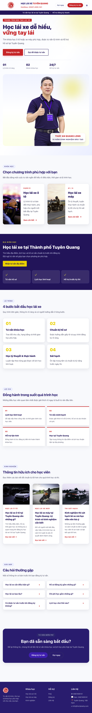

# Học lái xe Tuyên Quang

Website giới thiệu khóa học, blog SEO và hệ thống quản trị cho dịch vụ học lái xe ô tô, xe máy tại Tuyên Quang.

- Website: `https://hoclaixetq.com`
- Hotline: `0987 499 141`
- Backend: Node.js + Express + MySQL
- Frontend: React + Vite + TailwindCSS
- Runtime mục tiêu: Node.js 20, npm 10+

## 1. Chức năng chính

### Website công khai

- Trang chủ giới thiệu khóa học và thông tin liên hệ.
- Khóa học lái xe ô tô.
- Khóa học lái xe máy.
- Blog kinh nghiệm học lái xe.
- Chi tiết bài viết theo slug.
- Form đăng ký tư vấn.
- Form liên hệ.
- FAQ.
- Luyện đề thi lái xe:
  - Ô tô: B1, B2.
  - Xe máy: A1, A2.
  - Chọn đáp án, chuyển câu, theo dõi tiến độ.
  - Chấm điểm và xem giải thích sau khi nộp.
- Gọi điện trực tiếp qua `0987499141`.
- Responsive cho desktop, tablet và điện thoại.

### Admin CMS

Đường dẫn đăng nhập:

```text
/admin/login
```

Các khu vực quản trị:

- **Dashboard**
  - Số khách truy cập 30 ngày.
  - Lượt xem bài viết.
  - Số bài viết đã xuất bản.
  - Số đăng ký.
  - Biểu đồ analytics thủ công.
  - Trạng thái kết nối MySQL.
- **Đăng ký**
  - Xem thông tin người đăng ký.
  - Cập nhật trạng thái.
  - Xóa đăng ký.
  - Giao diện thẻ trên điện thoại.
- **Bài viết**
  - Thêm, sửa, xóa bài viết.
  - Chọn danh mục.
  - Chọn ngày đăng.
  - Chọn hoặc upload ảnh đại diện.
  - Soạn nội dung trực quan hoặc chỉnh HTML.
  - Gợi ý chèn thẻ `H2`, đoạn văn, danh sách và CTA.
  - Tự động tạo nội dung theo mẫu:
    - Hướng dẫn.
    - Kinh nghiệm.
    - Giới thiệu khóa học.
  - Tự động tạo SEO title và SEO description.
  - Tự động cập nhật sitemap khi bài viết thay đổi.
- **Danh mục**
  - Thêm, sửa, xóa danh mục.
- **Bộ câu hỏi luyện đề**
  - Phân nhóm Ô tô/Xe máy.
  - Phân nhóm B1/B2/A1/A2.
  - Thêm, sửa, xóa câu hỏi.
  - Thêm hoặc xóa đáp án.
  - Chọn đáp án đúng.
  - Lọc câu hỏi trùng nội dung.
  - Import câu hỏi từ Google Sheets dạng CSV.
- **Thư viện ảnh**
  - Upload ảnh.
  - Chọn ảnh dùng cho bài viết.
  - Xóa ảnh.
- **SEO tổng hợp**
  - Tự động điền SEO cho `hoclaixetq.com`.
  - Meta title, description, keywords.
  - Canonical URL.
  - Open Graph.
  - Robots index/follow.
  - Schema JSON-LD `DrivingSchool`.
  - SEO score và Google preview.
  - Nút cập nhật `sitemap.xml`.
- **Backup**
  - Tạo backup ZIP dữ liệu MySQL.
  - Lưu trên server hoặc tải về máy.
  - Tối đa 5 file backup.
  - Tự xóa file cũ nhất khi vượt giới hạn.
  - Xóa hoặc tải xuống backup.
  - Backup tự động theo ngày, tuần hoặc tháng.
  - Restore từ backup trên server hoặc file ZIP trên máy.

## 2. Hình ảnh giao diện

### Website công khai

#### Trang chủ



## 3. Cấu trúc dự án

```text
.
├── client/
│   ├── public/
│   │   ├── .htaccess
│   │   ├── robots.txt
│   │   └── sitemap.xml
│   └── src/
│       ├── components/
│       ├── hooks/
│       ├── layouts/
│       ├── pages/
│       │   ├── Admin/
│       │   ├── Blog/
│       │   ├── Home/
│       │   ├── Quiz/
│       │   └── ...
│       └── services/api.js
├── server/
│   ├── src/
│   │   ├── config/
│   │   ├── controllers/
│   │   ├── middlewares/
│   │   ├── routes/
│   │   ├── services/
│   │   └── server.js
│   ├── data/
│   ├── package.json
│   └── .env.example
├── docs/
│   └── screenshots/
├── client/dist.zip
└── server.zip
```

## 4. Cài đặt local

### Yêu cầu

- Node.js 20.x.
- npm 10.x.
- MySQL 8.x hoặc MySQL tương thích.

Kiểm tra phiên bản:

```bash
node -v
npm -v
```

### Cài dependencies

Từ thư mục gốc:

```bash
npm run install:all
```

Hoặc cài riêng:

```bash
cd client
npm install

cd ../server
npm install
```

### Cấu hình backend

Tạo file `server/.env` từ mẫu:

```bash
cd server
cp .env.example .env
```

Các biến quan trọng:

```env
PORT=5001
MYSQL_HOST=127.0.0.1
MYSQL_PORT=3306
MYSQL_DATABASE=nhhocmes_hoclaixetq
MYSQL_USER=your_mysql_user
MYSQL_PASSWORD=your_mysql_password
JWT_SECRET=replace_with_secure_secret
CLIENT_URL=http://localhost:5173
SITE_URL=https://hoclaixetq.com
BACKUP_DIR=backups
SITEMAP_PATH=../client/public/sitemap.xml
ADMIN_EMAIL=admin@example.com
ADMIN_PASSWORD_HASH=your_bcrypt_hash
```

Không commit `server/.env`.

### Chạy development

Mở hai terminal:

Terminal 1:

```bash
npm run dev:server
```

Terminal 2:

```bash
npm run dev:client
```

URL:

```text
Frontend: http://localhost:5173
Backend:  http://localhost:5001
Health:   http://localhost:5001/api/health
```

## 5. Build production

Build đầy đủ và tự động tạo bộ file triển khai:

```bash
npm run build
```

Script [build/build.mjs](./build/build.mjs) sẽ:

1. Build `client/dist`.
2. Đóng gói frontend thành `build/client.zip`.
3. Đóng gói backend thành `build/server.zip`.
4. Xuất MySQL local thành `build/hoclaixetq-mysql.sql`.

Mỗi lần chạy `npm run build`, cả ba file sẽ được cập nhật lại. File ZIP và SQL được loại khỏi Git vì chứa file build/dữ liệu có thể nhạy cảm.

Build frontend:

```bash
npm run build:client
```

Output:

```text
client/dist/
```

Build backend không cần biên dịch; kiểm tra cú pháp:

```bash
cd server
for file in $(find src -type f -name '*.js' -print); do node --check "$file"; done
```

Chạy backend production:

```bash
cd server
npm start
```

## 6. Đưa MySQL local lên hosting

Xuất SQL từ MySQL local:

```bash
cd server
"$HOME/.local/mysql/bin/mysqldump" \
  --defaults-extra-file="$HOME/.local/mysql/mysql-admin.cnf" \
  --single-transaction \
  --routines \
  --events \
  --triggers \
  --hex-blob \
  --no-create-db \
  nhhocmes_hoclaixetq \
  > "$HOME/Desktop/hoclaixetq-mysql.sql"
```

Trên cPanel:

1. Tạo database MySQL.
2. Tạo user MySQL.
3. Add user vào database với **ALL PRIVILEGES**.
4. Mở phpMyAdmin.
5. Chọn database ở cột bên trái.
6. Chọn **Import** và upload file SQL.

Nếu cPanel dùng prefix, tên thực tế có thể là:

```text
username_nhhocmes_hoclaixetq
```

Phải dùng đúng tên thực tế trong Environment Variables của Node.js App.

## 7. Deploy lên cPanel

### Backend

Dùng [server.zip](../server.zip):

1. Upload và giải nén vào Application Root.
2. Chọn Node.js `20.x`.
3. Chọn startup file:

```text
src/server.js
```

4. Cài dependencies:

```bash
npm install --omit=dev
```

5. Cấu hình Environment Variables:

```env
NODE_ENV=production
MYSQL_HOST=localhost
MYSQL_PORT=3306
MYSQL_DATABASE=ten_database_that_cua_cpanel
MYSQL_USER=ten_user_that_cua_cpanel
MYSQL_PASSWORD=mat_khau_mysql_hosting
JWT_SECRET=chuoi_bao_mat
CLIENT_URL=https://hoclaixetq.com
SITE_URL=https://hoclaixetq.com
BACKUP_DIR=backups
SITEMAP_PATH=../client/public/sitemap.xml
```

6. Restart Node.js App.

### Frontend

Dùng [client/dist.zip](../client/dist.zip):

1. Upload vào thư mục public của domain.
2. Giải nén.
3. Giữ file `.htaccess`.
4. Kiểm tra `index.html` nằm đúng thư mục public.

## 8. Kiểm tra sau deploy

```text
https://hoclaixetq.com/
https://hoclaixetq.com/api/health
https://hoclaixetq.com/sitemap.xml
https://hoclaixetq.com/quiz
https://hoclaixetq.com/admin/login
```

Health API cần trả:

```json
{
  "success": true,
  "message": "Server and MySQL are running"
}
```

Nếu nhận lỗi 503 từ LiteSpeed:

- Kiểm tra Node.js App có đang chạy không.
- Kiểm tra startup file là `src/server.js`.
- Kiểm tra Environment Variables.
- Kiểm tra user đã được cấp `ALL PRIVILEGES`.
- Xem log để biết mã lỗi:
  - `ER_ACCESS_DENIED_ERROR`: sai mật khẩu/user.
  - `ER_DBACCESS_DENIED_ERROR`: user chưa có quyền database.
  - `ER_BAD_DB_ERROR`: sai tên database.
  - `ECONNREFUSED` hoặc `ETIMEDOUT`: sai host/port.

## 9. Sitemap và SEO

Sitemap được tự động dựng từ các bài viết đã xuất bản khi:

- Thêm bài viết.
- Sửa bài viết.
- Xóa bài viết.
- Backend khởi động.

Có thể cập nhật thủ công tại Admin → **SEO tổng hợp** → **Cập nhật sitemap**.

SEO mặc định:

```text
https://hoclaixetq.com
```

Bao gồm:

- Meta title.
- Meta description.
- Keywords.
- Canonical.
- Open Graph.
- Robots.
- Schema DrivingSchool.

## 10. Backup và Restore

Backup nằm trong Admin → **Backup**:

- Tạo ZIP dữ liệu MySQL.
- Lưu trên server hoặc tải về máy.
- Tối đa 5 file.
- File thứ 6 tự xóa file cũ nhất.
- Xóa/tải file thủ công.
- Backup tự động theo ngày, tuần hoặc tháng.
- Restore từ file server hoặc file ZIP trên máy.
- Restore yêu cầu nhập `RESTORE`.

Backup không chứa `.env`, mật khẩu MySQL hoặc source code. Tuy nhiên backup có thể chứa hash tài khoản Admin và dữ liệu đăng ký, nên phải bảo vệ file.

## 11. Import câu hỏi từ Google Sheets

Trong Admin → **Bộ câu hỏi luyện đề**:

1. Google Sheets → **File → Download → Comma-separated values (.csv)**.
2. Upload file CSV.
3. Cấu trúc cột:

```text
Loại xe,Hạng bằng,Câu hỏi,A,B,C,D,Câu đúng
```

Ví dụ:

```text
Ô tô,B1,Câu hỏi mẫu,Đáp án A,Đáp án B,Đáp án C,Đáp án D,B
```

Hệ thống hỗ trợ:

- Ô tô: B1, B2.
- Xe máy: A1, A2.
- Đáp án đúng dạng A/B/C/D hoặc 1/2/3/4.
- Bỏ qua câu trùng.
- Báo lỗi theo từng dòng.
- Tối đa 10MB mỗi file.

## 12. Bảo mật

- Không commit `.env`.
- Không upload `.env` vào ZIP public.
- Không đưa mật khẩu MySQL vào README.
- Đổi mật khẩu MySQL nếu đã chia sẻ ở nơi không an toàn.
- Backup có dữ liệu nhạy cảm, cần lưu trữ riêng tư.
- Chỉ Admin đã đăng nhập mới được quản lý bài viết, quiz, backup và restore.
